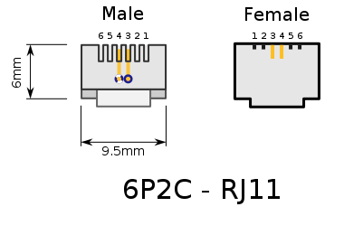

# NimbleStroker Projects
Some projects and notes I used to reverse engineer the NimbleStroker interface.

## NimbleStroker Protocol

### Physical
The NimbleStroker uses TTL level serial running at 115200 bps, 8-bit, no parity, 1 stop.

__WARNING: The powering coming over the cable is at 12v. Do not connect directly to Serial lines which run at 5v.__

| Pin | Description |
| --- | ----------  |
| 1   | Unused      |
| 2   | + 12v       |
| 3   | TX (at 5v)  |
| 4   | RX (at 5v)  |
| 5   | GND         |
| 6   | Unused      |

### Controller TX
courtesy of [Exploratory Devices](https://shop.exploratorydevices.com/)
<table>
  <tr>
    <th>Byte</th>
    <th>Name</th>
    <th>Bit 7</th>
    <th>Bit 6</th>
    <th>Bit 5</th>
    <th>Bit 4</th>
    <th>Bit 3</th>
    <th>Bit 2</th>
    <th>Bit 1</th>
    <th>Bit 0</th>
    <th>Description</th>
  </tr>
  <tr>
    <td>0</td>
    <td>Status</td>
    <td colspan="3">SYSTEM_TYPE</td>
    <td>SET_EXTEN</td>
    <td>AIR_SPRING</td>
    <td>AIR_IN</td>
    <td>AIR_OUT</td>
    <td>ACK</td>
    <td>Status Byte</td>
  </tr>
  <tr>
    <td>1</td>
    <td>PositionL</td>
    <td colspan="8">POSITION_COMMAND_L</td>
    <td rowspan="2">Position command bytes (10 bits, -1000 to 1000  with sign bit)</td>
  </tr>
  <tr>
    <td>2</td>
    <td>PositionH</td>
    <td colspan="3">NODE_TYPE</td>
    <td>0</td>
    <td>0</td>
    <td>sign</td>
    <td colspan="2">POSITION_COMMAND_H</td>
  </tr>
  <tr>
    <td>3</td>
    <td>ForceL</td>
    <td colspan="8">FORCE_COMMAND_L</td>
    <td rowspan="2">Force command bytes (10 bits, -1000 to 1000  with sign bit)</td>
  </tr>
  <tr>
    <td>4</td>
    <td>ForceH</td>
    <td>0</td>
    <td>0</td>
    <td>0</td>
    <td>0</td>
    <td>0</td>
    <td>0</td>
    <td colspan="2">FORCE_COMMAND_H</td>
  </tr>
  <tr>
    <td>5</td>
    <td>ChecksumL</td>
    <td colspan="8">CHECKSUM_L</td>
    <td rowspan="2">Simple Sum of bytes 0-4</td>
  </tr>
  <tr>
    <td>6</td>
    <td>ChecksumH</td>
    <td colspan="8">CHECKSUM_H</td>
  </tr>
</table>

### Actuator TX
courtesy of [Exploratory Devices](https://shop.exploratorydevices.com/)
<table>
  <tr>
    <th>Byte</th>
    <th>Name</th>
    <th>Bit 7</th>
    <th>Bit 6</th>
    <th>Bit 5</th>
    <th>Bit 4</th>
    <th>Bit 3</th>
    <th>Bit 2</th>
    <th>Bit 1</th>
    <th>Bit 0</th>
    <th>Description</th>
  </tr>
  <tr>
    <td>0</td>
    <td>Status</td>
    <td colspan="3">SYSTEM_TYPE</td>
    <td>0</td>
    <td>AIR_SPRING</td>
    <td>TEMP_LIMIT</td>
    <td>SENSOR_FAULT</td>
    <td>ACK</td>
    <td>Status Byte</td>
  </tr>
  <tr>
    <td>1</td>
    <td>PositionL</td>
    <td colspan="8">POSITION_FEEDBACK_L</td>
    <td rowspan="2">Position feedback bytes (10 bits, -1000 to 1000  with sign bit)</td>
  </tr>
  <tr>
    <td>2</td>
    <td>PositionH</td>
    <td colspan="3">NODE_TYPE</td>
    <td>0</td>
    <td>0</td>
    <td>sign</td>
    <td colspan="2">POSITION_FEEDBACK_H</td>
  </tr>
  <tr>
    <td>3</td>
    <td>ForceL</td>
    <td colspan="8">FORCE_FEEDBACK_L</td>
    <td rowspan="2">Force feedback bytes (10 bits, -1000 to 1000  with sign bit)</td>
  </tr>
  <tr>
    <td>4</td>
    <td>ForceH</td>
    <td>0</td>
    <td>0</td>
    <td>0</td>
    <td>0</td>
    <td>0</td>
    <td>sign</td>
    <td colspan="2">FORCE_FEEDBACK_H</td>
  </tr>
  <tr>
    <td>5</td>
    <td>ChecksumL</td>
    <td colspan="8">CHECKSUM_L</td>
    <td rowspan="2">Simple Sum of bytes 0-4</td>
  </tr>
  <tr>
    <td>6</td>
    <td>ChecksumH</td>
    <td colspan="8">CHECKSUM_H</td>
  </tr>
</table>
